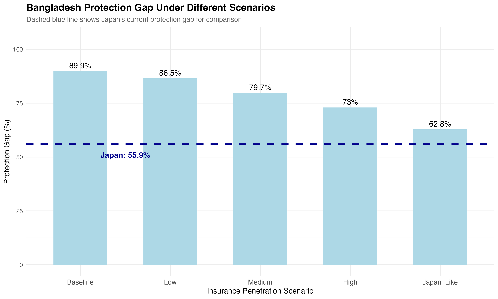
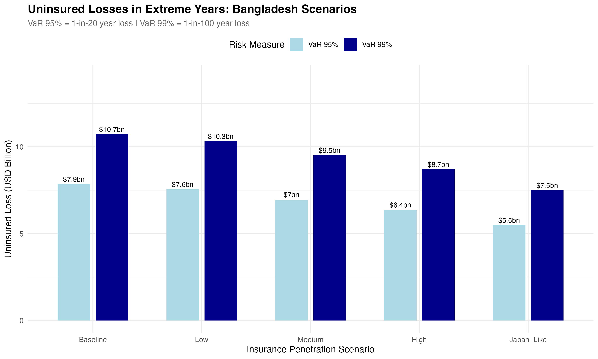
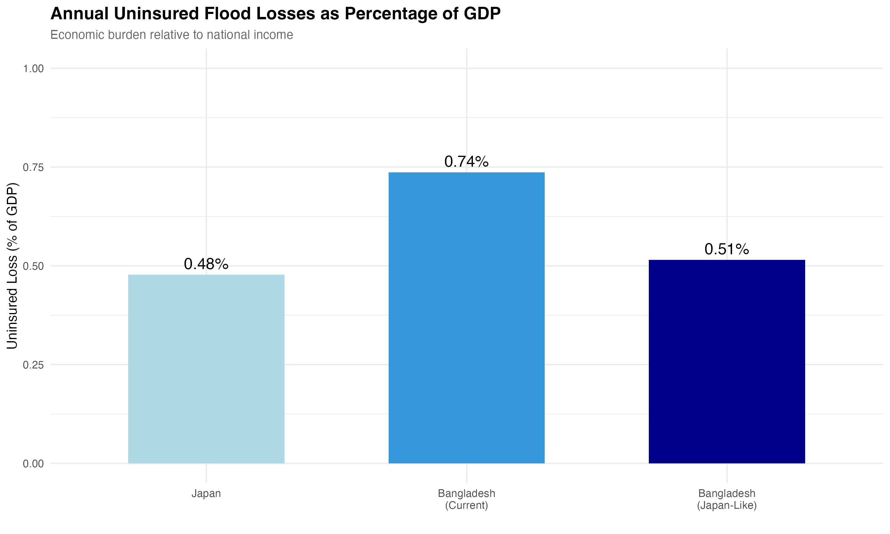
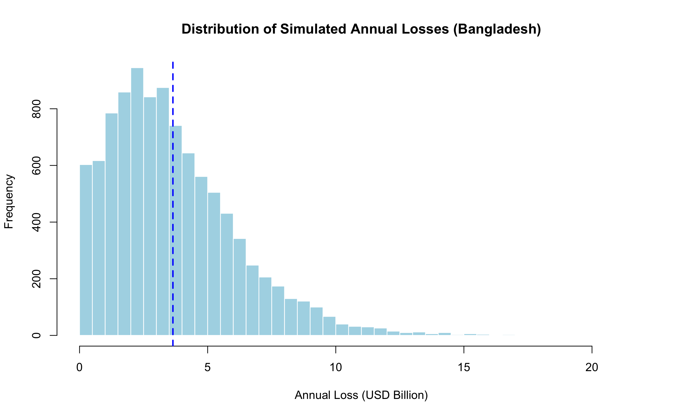

# Flood Insurance Protection Gaps: A Monte Carlo Comparison of Bangladesh and Japan

Final-year dissertation modelling the flood insurance protection gap (the share of economic flood losses left uninsured) in Bangladesh and Japan, using a Poisson-lognormal Monte Carlo simulation with 10,000 iterations per scenario.

## Project Overview

The protection gap, the difference between economic losses from a disaster and the losses actually covered by insurance, is one of the central problems in catastrophe risk and development finance. This project builds a stochastic simulation model to quantify that gap for flood risk in two very different markets: Bangladesh, where insurance penetration is minimal, and Japan, a mature insurance market with far higher penetration and claims recovery.

The model simulates annual flood losses using a Poisson process for event frequency and a lognormal distribution for event severity, calibrated to historical loss data for each country, then decomposes the resulting losses into insured and uninsured components to quantify the protection gap under a range of scenarios.

## Key Findings

### Simulated protection gap by scenario

Mean results across 10,000 Monte Carlo simulations per scenario:

| Scenario | Penetration | Mean protection gap (% of losses) | Mean uninsured loss (USD bn) | 95% VaR (USD bn) | 99% VaR (USD bn) |
|---|---|---|---|---|---|
| Japan (baseline) | 50% | 55.9% | 20.21 | 41.77 | 53.22 |
| Bangladesh (baseline) | 5% | 89.9% | 3.39 | 7.85 | 10.72 |
| Bangladesh (2x current) | 10% | 86.5% | 3.26 | 7.56 | 10.32 |
| Bangladesh (regional target) | 20% | 79.7% | 3.01 | 6.96 | 9.51 |
| Bangladesh (policy intervention) | 30% | 73.0% | 2.75 | 6.37 | 8.71 |
| Bangladesh (Japan-equivalent) | 50% | 62.8% | 2.37 | 5.49 | 7.49 |



Even matching Japan's insurance penetration exactly, Bangladesh's simulated protection gap (62.8%) remains well above Japan's own (55.9%), because Bangladesh's claims recovery rate (65%, against unsettled-claims data from the insurance regulator) is lower than Japan's (85%). **Penetration alone does not close the gap; the claims settlement pipeline matters too.**

### Tail risk



Even in the most optimistic Bangladesh scenario modelled, the 1-in-100-year (99% VaR) uninsured loss is USD 7.49bn, more than twice the baseline scenario's mean annual economic loss. This is the kind of result a simple point-estimate of "the gap" would miss entirely; the simulation exists precisely to expose the tail.

### The burden looks different once you scale by GDP



In absolute USD terms Japan's uninsured losses (mean USD 20.2bn/year) dwarf Bangladesh's (USD 3.4bn/year). Scaled against each country's GDP, the picture reverses: Bangladesh's baseline uninsured loss is **0.74% of GDP** versus Japan's **0.48%**, despite Bangladesh's dollar losses being roughly six times smaller. The absolute numbers understate how much heavier the burden actually falls on the smaller economy.

### Validating the loss distribution against observed events



The lognormal severity distribution used for Bangladesh was checked against 8 historical flood/cyclone loss events (USD 0.032bn to USD 2.8bn), confirming the fitted distribution places observed events at plausible percentiles rather than in the extreme tails.

## Methodology

- **Frequency**: Poisson process, λ = 3.38 events/year (Bangladesh, combined flood and cyclone), λ = 3.5 events/year (Japan)
- **Severity**: Lognormal distribution, parameters derived from mean/SD of historical event losses (Bangladesh: μ = USD 1.09bn, σ = USD 0.90bn, n = 8 events; Japan: μ = USD 9.90bn, σ = USD 4.50bn, n = 6 events)
- **Protection gap**: `insured_loss = economic_loss × penetration × recovery_rate`; `protection_gap = economic_loss − insured_loss`
- **Simulations**: 10,000 iterations per scenario, seed fixed for reproducibility
- **Calibration sources**: Swiss Re Institute sigma reports, GIAJ (General Insurance Association of Japan), Bangladesh insurance regulator (IDRA) settlement data

## Methodological Limitations (worth reading before the headline numbers)

I want to be upfront about three weaknesses in the model rather than let the headline percentages speak for themselves:

1. **The protection gap percentage is deterministic conditional on a loss year, not itself a Monte Carlo output.** Because `insured_loss = economic_loss × p × r` with p and r held constant, the ratio `protection_gap / economic_loss` reduces algebraically to `1 − p×r` in every year with at least one flood event. Concretely: Bangladesh baseline works out to 1 − (0.05 × 0.65) = 96.75%, and Japan baseline to 1 − (0.50 × 0.85) = 57.5%, in any year losses occur at all. The 10,000-run simulation adds real value for the *absolute* loss figures and tail risk (VaR95/VaR99), but the percentage gap itself is closer to an algebraic sensitivity result than an empirical simulation finding. A more defensible version of this model would treat penetration and recovery rate as random variables (e.g. p ~ Beta), not fixed constants, so the gap percentage is genuinely stochastic.
2. **Japan's penetration parameter has an element of circularity.** It was back-solved from Japan's observed protection gap and an assumed recovery rate, then the same equation is run forward to "reproduce" that gap. That's internally consistent, not independent validation. Bangladesh's penetration figure (5%, from Swiss Re) doesn't have this problem since it comes from an independent source.
3. **Small calibration samples.** The severity distribution is fitted to 8 events for Bangladesh and 6 for Japan. That's a normal constraint for country-level catastrophe data, but it means the tail estimates (VaR99 in particular) carry more parameter uncertainty than the point estimates suggest.

## Technologies Used

- **R**: `dplyr`, `ggplot2`, `readxl`

## How to Run

```r
# Install required packages
install.packages(c("readxl", "dplyr", "ggplot2"))

# Knit the R Markdown file
rmarkdown::render("protection_gap_simulation.Rmd")
```

## Author

**Amba Sharma** — BSc Mathematics (Applied Mathematics emphasis), University of Leicester.
